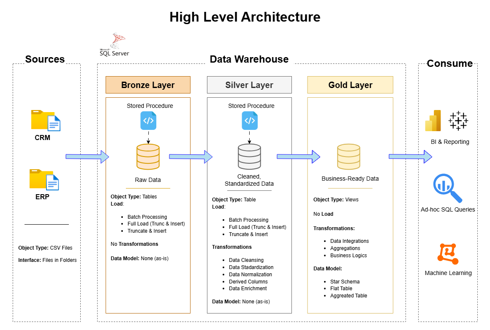

# Data Warehouse and Analytics Project

Welcome to the **Data Warehouse and Analytics Project** repository!  
This project demonstrates a comprehensive data warehousing and analytics solution, from building a data warehouse to generating actionable insights. 
Presented as a portfolio project that highlights industry best practices in data engineering and analytics.

---

## 🏗️ Data Architecture
The data architecture for this project follows Medallion Architecture Bronze, Silver, and Gold layers:


1. **Bronze Layer**: Stores raw data as-is from the source systems. Data is ingested from CSV Files into SQL Server Database.
2. **Silver Layer**: This layer includes data cleansing, standardization, and normalization processes to prepare data for analysis.
3. **Gold Layer**: Houses business-ready data modeled into a star schema required for reporting and analytics.

---

## 📁 Project Overview:

This project involves:
1.  **Data Architecture:** Designing a Modern Data Warehouse Using Medallion Architecture **Bronze**, **Silver**, and **Gold** layers.
2.  **ETL Pipelines:** Extracting, transforming, and loading data from source systems into the warehouse.
3.  **Data Modeling:** Developing fact and dimension tables optimized for analytical queries.
4.  **Analytics & Reporting:** Creating SQL-based reports and dashboards for actionable insights.

✅ This portfolio project showcases skills in:
* SQL Development
* Data Architect
* Data Engineering
* ETL Pipeline Developer
* Data Modeling
* Data Analytics

---
## ⚙️ Important Links & Tools: 

Below are the links and tools used for the project.

* [Datasets](https://github.com/KLinh62/SQL-Data-Warehouse-Project/tree/ff499613f4374f65426a2d3d977742d98579db78/datasets): Access to the project dataset (.csv files).
* [SQL Server Management Studio (SSMS)](https://learn.microsoft.com/en-us/ssms/install/install?view=sql-server-ver16): GUI for managing and interacting with databases.
* [DrawIO](https://www.drawio.com/): Design data architecture, models, flows, and diagrams.
* [Notion Project Steps](https://www.notion.so/My-Data-Warehouse-Project-20fb404cdc59804987b3fa411d94675c): Access to All Project Phases and Tasks.

---
## 🚀 Project Requirements 

### Building the Data Warehouse (Data Engineering)

#### Objective
Develop a modern data warehouse using SQL Server to consolidate sales data, enabling analytical reporting and informed decision-making.

#### Specifications
- **Data Sources**: Import data from two source systems (ERP and CRM) provided as CSV files.  
- **Data Quality**: Cleanse and resolve data quality issues prior to analysis.  
- **Integration**: Combine both sources into a single, user-friendly data model designed for analytical queries.  
- **Scope**: Focus on the latest dataset only; historization of data is not required.  
- **Documentation**: Provide clear documentation of the data model to support both business stakeholders and analytics teams.

### BI: Analytics & Reporting (Data Analytics)

#### Objective
Develop SQL-based analytics to deliver detailed insights into:  
- **Customer Behavior**  
- **Product Performance**  
- **Sales Trends**

These insights empower stakeholders with key business metrics, enabling strategic decision-making.

---
## 📂 Repository Structure
```
data-warehouse-project/
│
├── datasets/                           # Raw datasets used for the project (ERP and CRM data)
│
├── docs/                               # Project documentation and architecture details
│   ├── etl.png                         # Draw.io file shows all different techniquies and methods of ETL
│   ├── data_architecture.png           # Draw.io file shows the project's data architecture
│   ├── data_catalog.md                 # Catalog of datasets, including field descriptions and metadata
│   ├── data_flow.png                   # Draw.io file for the data flow diagram
│   ├── data_integration.png            # Draw.io file for data integration, showing the objects and the relationships between tables
│   ├── data_model.png                  # Draw.io file for data models (star schema)
│   ├── data_layers.png                 # Draw.io files outlines the specific processes and characteristics of the data layers, along with key considerations for conducting source system interviews
│   ├── naming-conventions.md           # Consistent naming guidelines for tables, columns, and files
│
├── scripts/                            # SQL scripts for ETL and transformations
│   ├── bronze/                         # Scripts for extracting and loading raw data
│   ├── silver/                         # Scripts for cleaning and transforming data
│   ├── gold/                           # Scripts for creating analytical models
│
├── tests/                              # Test scripts and quality files
│
├── README.md                           # Project overview and instructions
├── LICENSE                             # License information for the repository
├── .gitignore                          # Files and directories to be ignored by Git
└── requirements.txt                    # Dependencies and requirements for the project
```

---

## 🛡️ License

This project is licensed under the [MIT License](LICENSE). You are free to use, modify, and share this project with proper attribution.

## 🌟 About Me

Hi there! I'm **Linh Nguyen**, an Supply Chain professional who is passonate about data.

[](https://www.linkedin.com/in/kh%C3%A1nh-linh-nguy%E1%BB%85n-346115176/)

 
